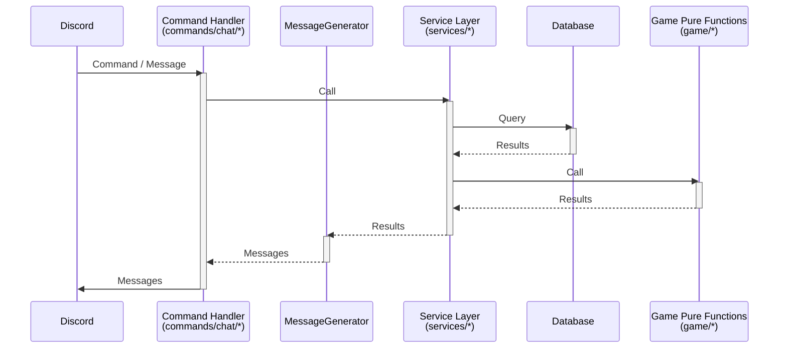

<context>
# Overview
Eat Poop You Cat (EPYC) is a party game that combines elements of the classic games "Telephone" and "Pictionary." The name comes from a memorable example of how the game can produce humorous results. It's also known by other names such as "Telestrations" or "Telephone Pictionary." This document outlines the requirements for a Discord bot implementation of EPYC.

# Core Features

## Basic Gameplay
1.  **Initial Turn**: The first player writes a sentence or phrase.
2.  **Drawing Turn**: The second player draws an illustration based solely on that sentence.
3.  **Describing Turn**: The third player writes a sentence based solely on the drawing (without seeing the original sentence).
4.  **Alternating Turns**: This pattern of alternating between writing and drawing continues. Each player takes one and only one turn per game (unless `return_count` is configured).
5.  **Reveal**: At the end, the final results are revealed to everyone, showing how the original sentence evolved through the game.

## Discord Bot Implementation
* **Game Start**: A game is initiated on a Discord server by the first player using the `/start` command. This player is immediately DM'd a request for an initiating turn.
* **Joining a Game**: When another player uses the `/play` command, they are assigned to the active game they have not yet played in that will become stale soonest (based on its last update time and stale timeout setting). They are then DM'd the previous turn.
* **Submitting Turns (DM)**:
    * If the previous turn was writing, the player responds to the DM directly with an uploaded image.
    * If the previous turn was a drawing, the player responds to the DM directly with a sentence or phrase.
* **Turn Visibility**: Players can only see the immediately preceding completed turn.
* **Time Limits**: The bot enforces configurable time limits for each turn.

## Game Flow
1.  **Game Initialization**:
    * A player uses the `/start` command to initiate a game, setting optional rules/parameters.
    * The bot immediately DMs the first player for a starting sentence.
2.  **Turn Sequence**:
    * Players signal their intent to play using the `/play` command.
    * They are assigned to a game, and the bot DMs them the previous player's completed turn.
        * If no game is available, they are told to `/start` a new game if they wish to play.
    * The player responds to the DM with their turn.
3.  **Game Conclusion**:
    * A game concludes when:
        1.  A minimum number (configurable) of turns have been completed AND the game has reached a certain level of staleness (configurable), OR
        2.  The game has reached a maximum number (configurable) of turns.
    * The bot posts the complete sequence in the "completed" channel.
        * Users can react and comment on the results.

## Seasons
A season is a collection of games played by one group of players concurrently on one server.
* **Creation**: A player uses the `/season open_duration:<duration>` command. A three-word ID is generated for sharing.
* **Joining**: Other players join using `/season join id:<id>`.
* **Activation**: Once the `open_duration` has passed (or `max_players` is reached):
    * The season becomes active; no more players can join.
    * One game is created per player, and that player is DM'd for an initiating turn.
* **Season Gameplay**:
    * A game is not completed until every player in the season has played in it (or been skipped due to timeout).
    * The season is not completed until every game has been completed. (A completed season with N players contains N games, each with N turns).
    * Turns in a season cannot be flagged.
    * `min_turns`, `max_turns`, `returns`, and `stale_timeout` are ignored for season games.
    * Pending turns are distributed to ensure variety in player order and turn type (writing/drawing).

# User Experience

## Key User Flows
* **Starting a Game**: User initiates `/start`, receives DM, submits first turn.
* **Playing a Turn**: User initiates `/play`, receives DM with previous turn, submits their turn (text or image).
* **Viewing Completed Games**: Users view the full chain of a completed game in a designated channel.
* **Joining/Playing a Season**: Users create or join a season, then play through multiple games within that season.

## UI/UX Considerations
* **Direct Messages (DMs)**: Core gameplay (receiving turns, submitting turns) happens via DMs with the bot.
* **Slash Commands**: Users interact with the bot using Discord slash commands (`/start`, `/play`, `/season`, etc.).
* **Notifications**:
    * Players receive DM notifications for turn timeouts.
    * All players receive a notification when a game they participated in is completed.
* **Clarity**: Instructions and prompts from the bot should be clear and concise.
* **Error Handling**: Users should receive informative messages if a command fails or an action cannot be performed (e.g., trying to `/play` with an already pending turn).

## User Terminology
* **Game Creator**: The player who initiated the game with the `/start` command.
* **Player**: A Discord user participating in an EPYC game.
* **Admin**: A server administrator with additional privileges for game moderation.
* **Test Player**: A virtual player created for testing purposes.
</context>
<PRD>
# Technical Architecture

## System Components
* **Discord Bot**: The primary application interacting with users on Discord.
* **Service Layer**: Encapsulates core business logic (game management, player management, turn processing). (e.g., `GameService`, `PlayerService` in `src/services/*.ts`).
* **Database**: Stores game state, player information, turns, season data, etc.
* **Command Handlers**: Process Discord slash commands and interactions, call service layer methods, and format responses. (Located in `src/commands/chat`).

## Implementation Notes
* Discord Commands are defined in `src/commands/chat`.
* Discord Interactions that are game-oriented primarily call methods within the service layer.
* Service methods return structured data (e.g., game objects, status updates, error details).
* The responsibility for constructing complete, user-facing strings for all bot replies (DMs, public channel messages, ephemeral messages) lies within the command handler files in `src/commands/chat`.
* The command's `execute` method acts as a thin shell: it calls service method(s), receives structured data, passes this data to its local message generation function(s), and then sends the resulting string(s) to Discord.
* This architecture decouples presentation logic from core service responsibilities and centralizes message formatting logic.
* Service methods depend on pure logic functions (e.g., in `src/game/`) which are unit-tested without mocking external dependencies.

## System Terminology
* **Announcement Channel**: Channel for new game/season announcements.
* **Completed Channel**: Channel where completed game sequences are posted (defaults to announcement channel).
* **Admin Channel**: Private channel for flagged turns and admin messages. If not set, turns cannot be flagged, and admin messages go to the announcement channel.
* **Uncensored Channel**: Optional private channel for uncensored games.

# Development Roadmap
[Break down the development process into phases:
- MVP requirements
- Future enhancements
- Do not think about timelines whatsoever -- all that matters is scope and detailing exactly what needs to be build in each phase so it can later be cut up into tasks]

# Logical Dependency Chain
[Define the logical order of development:
- Which features need to be built first (foundation)
- Getting as quickly as possible to something usable/visible front end that works
- Properly pacing and scoping each feature so it is atomic but can also be built upon and improved as development approaches]

# Risks and Mitigations

## Potential Risks
* **Scope Creep**: Adding too many features beyond the core EPYC gameplay.
* **Scalability**: Ensuring the bot can handle many concurrent games and users on large servers.
* **Abuse/Spam**: Users submitting inappropriate content or exploiting game mechanics.
* **User Churn**: Players losing interest if games take too long or are hard to join.

## Mitigations
* **Phased Development**: Focus on core MVP features first, then iterate.
* **Efficient Database Design & Queries**: Optimize for performance.
* **Moderation Tools**:
    * **Turn Flags**: Players can flag turns as spam, low-effort, or offensive. Flagged games are paused and posted to an "admin" channel. Admins can delete the turn, remove the flag, or ban the player.
    * **Admin Commands**: Server administrators can end games prematurely.
    * **Banning**: Admins can ban users.
* **Configurable Timeouts**: `writing_timeout`, `drawing_timeout`, `stale_timeout` help keep games moving.
* **Clear Game Discovery**: `/play` command assigns users to active games efficiently.
* **Turn Timeouts**: If a player doesn't respond within the time limit, they are skipped, and the game becomes available to other players.

# Appendix

## Game Terminology
* **EPYC**: "Eat Poop You Cat" - The full name of the game.
* **Telephone Pictionary / Telestrations**: Alternative names for the game.
* **Turn**: A single interaction by a player (either writing a description or drawing an image).
* **Writing Turn**: A turn where a player writes a text description.
* **Drawing Turn**: A turn where a player creates and submits an image.
* **Chain**: The sequence of turns in a game.
* **Game**: An instance of an EPYC game, containing one chain.
* **Game ID**: Unique identifier for a game instance.
* **Turn ID**: Unique identifier for a specific turn in a game.
* **Season**: A collection of games played by one group of players concurrently on one server.
* **Standard Game**: A game with `turn_pattern: writing,drawing` and no returns.
* **Flash Game**: (Informal) A game with short timeouts (e.g., writing <= 2 min, drawing <= 10 min, stale <= 15 min).

## Game Rules (Configurable Parameters)
* `turn_pattern`: `drawing,writing` or `writing,drawing`. Default: `writing,drawing`.
* `return_count`: Number of additional times a player can take a turn in the same game. Default: `0`.
* `return_cooldown`: Number of turns by others before a player can return (if `return_count > 0`). Default: `null`.
* `writing_timeout`: Time limit for a writing turn. Default: `1d`.
* `writing_warning`: Time before writing turn timeout for a warning. Default: `1m`.
* `drawing_timeout`: Time limit for a drawing turn. Default: `1d`.
* `drawing_warning`: Time before drawing turn timeout for a warning. Default: `10m`.
* `stale_timeout`: Time limit for a game to be considered stale. Default: `7d`.
* `min_turns`: Minimum completed turns for game completion. Default: `6`.
* `max_turns`: Maximum completed turns. Default: `undefined` (no maximum).

## Season Rules (Configurable Parameters)
* `open_duration`: Time a season is open for users to join. Default: `7d`.
* `min_players`: Minimum players to start a season. Default: `2`.
* `max_players`: Maximum players in a season. Default: `undefined`.
    * _Either `open_duration` or `max_players` must be set. If both, the season closes when the first condition is met._

## Game States
* **Setup**: Game being created (instantly becomes pending).
* **Pending**: Waiting for a specific player's turn.
* **Active**: In progress, not waiting for a specific player.
* **Paused**: Halted due to flagged content or admin action.
* **Completed**: Game finished normally.
* **Terminated**: Ended prematurely by an admin.
* **Stale**: (Condition) Inactive longer than `stale_timeout`.

## Turn States
* **Created**: Turn initially created (instantly becomes pending).
* **Pending**: Assigned to a player who is working on it.
* **Completed**: Turn has been submitted.
* **Flagged**: Turn flagged for review.
* **Removed**: Turn removed due to timeout or admin action.

## Player States
* **Not Banned**: Player not banned by an admin.
* **Banned**: Player banned by an admin.

## Moderation Terminology
* **Flag**: Marking a turn as inappropriate, pausing the game.
* **Ban**: Banning a user from playing on a server.
* **Admin Commands**: Special commands for server/bot administrators.

## Time Durations
Time durations are stored as human-readable strings, e.g.:
* `7d`
* `12h`
* `30m`
* `30s`

## Example Flows
See `FLOWS.md` (Referenced from original PRD)
</PRD>