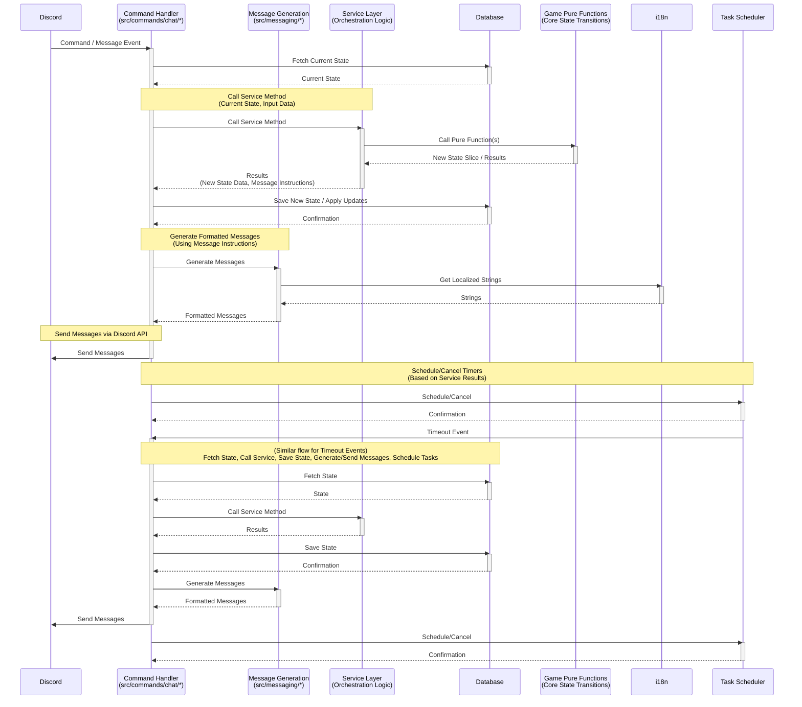

# Technical Architecture
## System Components
* **Discord Bot**: The primary application interacting with users on Discord. Based on Kevin Novak's TypeScript Discord.js Bot Template.
* **Service Layer**: Encapsulates core business logic (season management incl. name generation, game management within seasons, player management, turn processing). (e.g., `SeasonService`, `GameService`, `PlayerService`, `TurnService` in `src/services/*.ts`).
* **Platform Independence:** Service layers (`src/services/*`) MUST remain platform-independent. They should not contain logic specific to Discord (e.g., formatting messages for Discord, directly calling Discord API functions like `sendDm`). Platform-specific interactions should be handled by command handlers (`src/commands/chat/*`), dedicated DM handlers (part of Task 10), or the messaging layer (`src/messaging/*`, Task 27).
* **Database**: Stores game state, player information, turns, season data, etc. Prisma on top of PostgreSQL.
* **Command Handlers**: Process Discord slash commands and interactions, call service layer methods, and format responses. (Located in `src/commands/chat`).
* **Task Scheduler**: Component responsible for monitoring claim and submission timeouts and triggering the necessary actions (dismissing offers, skipping players, offering turn to next eligible player).
* **Testing**: We use vitest, not Jest.

## Implementation Notes

* Discord Commands are defined in `src/commands/chat`.
* Discord Interactions that are game/season-oriented primarily call methods within the service layer.
* Service methods return structured data (e.g., season/game objects, status updates, error details), **including structured data payloads for any required messages or notifications.**
* The responsibility for constructing complete, user-facing strings for all bot replies (DMs, public channel messages, ephemeral messages) lies within the command handler files in `src/commands/chat`.
* The command's `execute` method acts as a thin shell: it calls service method(s), receives structured data, passes this data to its local message generation function(s), and then sends the resulting string(s) to Discord.
* This architecture decouples presentation logic from core service responsibilities and centralizes message formatting logic.
* Service methods depend on pure logic functions (e.g., in `src/game/`) which should be unit-tested without mocking external dependencies.

## Testing Requirements for New Commands

Whenever a new command is added, the following testing procedures must be implemented:
- Integration tests: Must be conducted against a test database. These tests should not interact with Discord.
- Unit tests: Must be developed for the logic layer of the command.